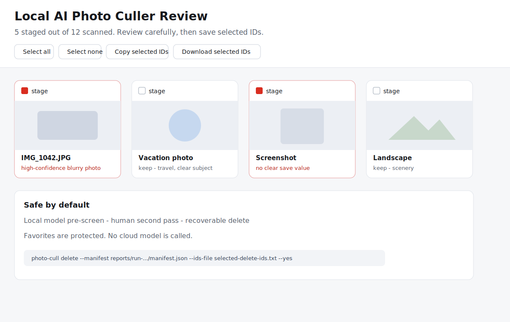

# Local AI Photo Culler

Privacy-first Apple Photos cleanup with a local vision model.

This tool asks a local Ollama vision model to **pre-screen** your Apple Photos
library for obvious deletion candidates, then gives you a browser-based review
page for the human second pass. Nothing is uploaded to a cloud model.



Illustrative demo only. A real scan generates the same kind of browser review
page, but the actual thumbnails, filenames, reasons, and counts come from your
own local Photos library.

## Does It Need a Client?

No separate client is required.

Local AI Photo Culler is a command-line tool. It talks directly to:

- Apple Photos through a tiny local PhotoKit helper.
- Ollama through its local HTTP API, normally `http://127.0.0.1:11434`.
- Your normal browser for the generated `review.html` page.

You do not need to connect it to a desktop assistant, iCloud, Google Photos,
OpenAI, Claude, Gemini, or any cloud model. The included Codex skill wrapper is
optional for people who want to run the workflow from an agent.

It is intentionally cautious:

- Photos are analyzed locally through Ollama.
- Favorites are never staged for deletion.
- Scans produce a manifest and review HTML before any delete command exists.
- Deletion moves assets to Apple Photos **Recently Deleted**, where macOS keeps
  them recoverable for about 30 days.
- macOS Photos still shows its own confirmation dialog.

## Why

Most photo cleaners are either cloud AI, duplicate-only, or fully manual. This
project is for the middle lane:

1. Let a local vision model do the boring first pass.
2. Review the suggested candidates yourself.
3. Delete only the selected photos, recoverably.

That makes it useful for private photo libraries, screenshots, receipts, blurry
shots, accidental captures, and obvious junk where cloud upload is not worth it.

## Requirements

> **macOS only.** This tool reads and edits the **Apple Photos** library through
> a PhotoKit helper, and depends on the Apple Photos "Recently Deleted" album for
> recoverable deletes. It does **not** run on Windows or Linux — there is no
> Apple Photos / PhotoKit there. On a non-macOS system `npm install` is blocked
> by the `os` field and the commands exit with a clear message.

- macOS with Apple Photos.
- Node.js 20 or newer.
- Xcode Command Line Tools (`xcode-select --install`).
- [Ollama](https://ollama.com/) running locally.
- A local vision model, for example:

```bash
ollama pull llava:latest
```

Other Ollama vision models should work if they support image input through
`/api/chat`.

## Install

```bash
git clone https://github.com/CCCCCRH0405/local-ai-photo-culler.git
cd local-ai-photo-culler
npm run build:helper
npm link
```

For agent workflows, this repo also includes a Codex-compatible skill wrapper at
`codex-skill/local-ai-photo-culler/SKILL.md`.

Then grant Photos permission:

```bash
photo-cull auth
```

If macOS does not show the permission prompt, open:

`System Settings -> Privacy & Security -> Photos`

and allow the terminal app you are running from.

There are no npm dependencies to install. The only compiled part is the local
PhotoKit helper, built by `npm run build:helper`.

## Scan

Start conservatively:

```bash
photo-cull scan --limit 24 --model llava:latest --level conservative
```

Screenshot cleanup:

```bash
photo-cull scan --screenshots-only --level medium --limit 50
```

Date range:

```bash
photo-cull scan --from 2024-01-01 --to 2024-12-31 --limit 80
```

Each run creates:

- `reports/run-.../manifest.json`
- `reports/run-.../review.html`
- `reports/run-.../thumbs/*.jpg`

Open `review.html`, inspect the thumbnails, select/deselect candidates, then
download or copy `selected-delete-ids.txt`.

## Delete

Deletion requires an explicit `--yes`:

```bash
photo-cull delete \
  --manifest reports/run-2026-05-30T12-00-00.000Z/manifest.json \
  --ids-file selected-delete-ids.txt \
  --yes
```

Without `--ids-file`, the command uses every staged candidate from the manifest.
That is convenient for tests, but the intended workflow is to use the review
HTML and pass a manually selected IDs file.

## Deletion Levels

`conservative`

Stages exact exported-image duplicates and high-confidence blurry or too-dark
photos. Good first run.

`medium`

Adds screenshots that the model thinks have no save value.

`aggressive`

Stages anything the model did not explicitly mark as `keep`. Use only for small
batches where you will review every thumbnail carefully.

## Privacy Model

The tool exports reduced-size JPEG thumbnails to the local `reports/` directory
and sends those thumbnails to your local Ollama server. No cloud API is called by
this project.

If your Ollama server is not local, your privacy boundary is wherever that server
runs. Keep `OLLAMA_BASE_URL` pointed at `http://127.0.0.1:11434` for the intended
local-only workflow.

## Roadmap

- Perceptual duplicate detection for burst/near-duplicate photos.
- Resume cursor for long libraries.
- Better HTML review filters by reason, score, screenshot, and date.
- Optional standalone desktop app wrapper.

## Project Template Status

This repo includes the basics expected by most open-source projects:

- MIT license.
- README with requirements, install, scan, delete, privacy, and safety notes.
- `package.json` binary entry for `photo-cull`.
- `.gitignore` for generated reports, build cache, and compiled helper.
- `CONTRIBUTING.md` and `SECURITY.md`.
- Optional Codex skill wrapper.

Add a screenshot of `review.html` after your first local scan to make the README
more inviting.

## Safety Notes

Local vision models make mistakes. Treat the AI result as a first-pass assistant,
not a final judge. The correct workflow is always:

`AI pre-screen -> human review -> recoverable delete`
